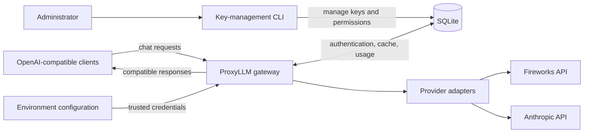
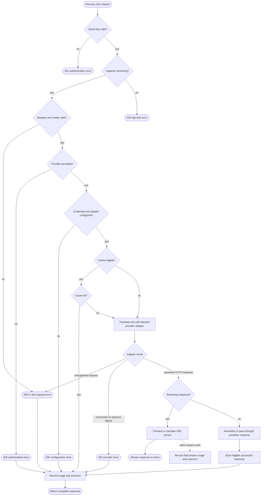
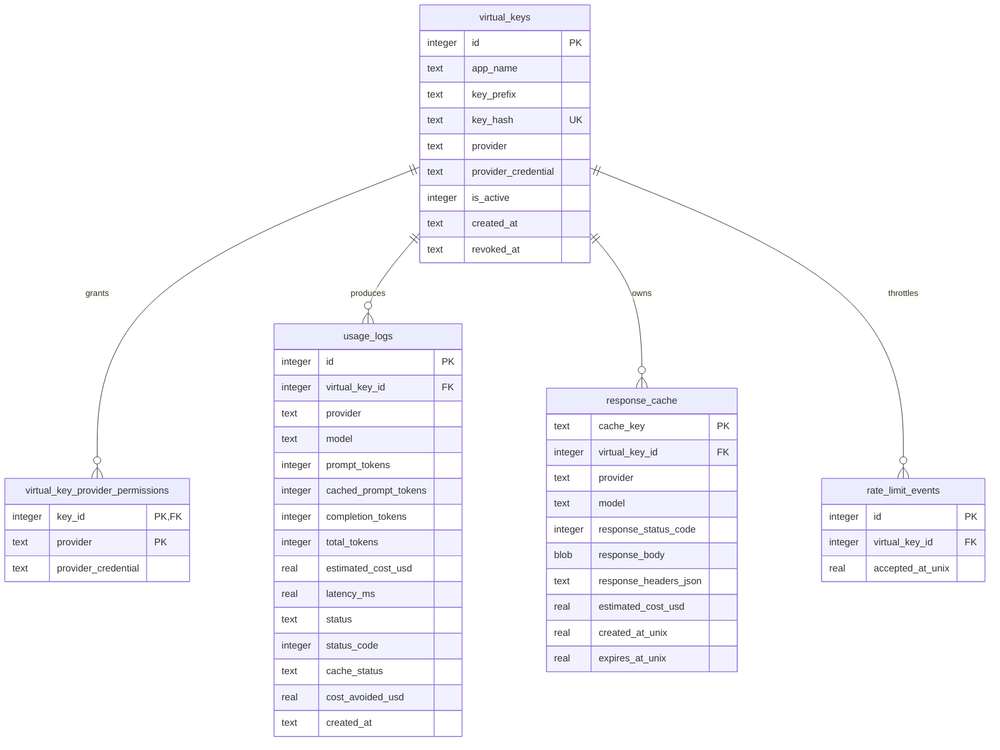

# ProxyLLM Architecture

**Status:** Current design  
**Architecture style:** Asynchronous modular monolith  
**Primary interface:** OpenAI-compatible `POST /v1/chat/completions`

This document describes how ProxyLLM is structured, why the current design was chosen, where its trust boundaries are, and when the architecture should change.

## 1. Goals

ProxyLLM is designed to provide:

- one stable API for multiple LLM providers;
- server-side ownership of real provider credentials;
- revocable application-level virtual keys;
- persistent per-key exact sliding-window request limiting;
- explicit model routing and provider authorization;
- normalized complete and streaming responses;
- privacy-conscious usage, cost, and latency measurement; and
- optional response caching for eligible requests.

The current design optimizes for local development, prototypes, portfolio work, and controlled internal deployments. It favors a small operational footprint and clear module boundaries over distributed-system complexity.

## 2. Non-goals

The current implementation does not attempt to provide:

- automatic provider fallback or load balancing;
- distributed caching or multi-region operation;
- a high-availability database;
- distributed rate limiting, quotas, or budget enforcement;
- a public or multi-user administrative web service;
- arbitrary provider URLs, credentials, or models supplied by clients;
- semantic caching; or
- complete translation of every provider feature, such as Anthropic tool calling.

## 3. High-level system overview



The client controls the public model name and generation parameters. It does not control the upstream URL, real provider credential, provider adapter, or database permission.

## 4. Component design

| Component | Responsibility | Key files |
| --- | --- | --- |
| HTTP application | Owns request validation, routing, caching, response construction, and usage logging | `api/main.py` |
| Authentication middleware | Validates bearer virtual keys, enforces their request limit, and attaches safe key metadata | `api/middleware.py` |
| Rate-limit policy | Atomically consumes persistent rolling-window capacity per virtual key | `auth/rate_limit.py` |
| Key administration | Creates, lists, grants permissions to, and revokes virtual keys | `auth/cli.py`, `auth/keys.py` |
| Persistence | Initializes and queries the SQLite schema | `auth/database.py` |
| Model registry | Maps allowed public model names to trusted providers, upstream models, and price snapshots | `providers/registry.py` |
| Provider contract | Defines provider-independent requests, responses, credentials, and errors | `providers/base.py` |
| Connection pools | Reuses provider connections until application shutdown | `providers/connections.py` |
| Fireworks adapter | Forwards an already OpenAI-compatible provider protocol | `providers/fireworks.py` |
| Anthropic adapter | Translates OpenAI chat requests and Anthropic Messages responses in both complete and streaming modes | `providers/anthropic.py` |
| Usage tracking | Normalizes token usage, estimates cost, and observes streams without buffering them | `usage/tracking.py` |
| Response cache | Determines eligibility and builds privacy-scoped deterministic cache keys | `usage/cache.py` |
| Measurement tools | Measure overhead, cache behavior, and load independently of the request path | `benchmarks/` |

These gateway modules run in one service. The optional `dashboard/` is a separate
localhost-only process for recorded usage, key administration and verified
maintenance. Its session-protected `/admin/` endpoints reuse CLI operations; writes
require an exact Origin, a request token and bounded JSON input. This local trust
boundary does not provide multi-user administrator authentication. `client_testing/` exercises the gateway
without requiring a separate end-user app.

## 5. Request-processing flow

The main request path is shown separately from the system overview so authentication, routing, and cache decisions remain easy to follow.



Validation and authorization happen before a real provider credential is resolved or an upstream connection is opened.

### Streaming behavior

Streaming uses the same authentication, routing, and authorization path. The differences are:

1. The response cache is always bypassed.
2. Fireworks SSE bytes are passed through unchanged because they are already OpenAI-compatible.
3. Anthropic named SSE events are translated into OpenAI-compatible chat-completion chunks.
4. Usage tracking observes a copy of each chunk without buffering the full stream.
5. The final usage row distinguishes success, provider error, incomplete output, stream failure, and client disconnection.
6. Upstream responses and HTTP clients are closed in `finally` blocks after completion, cancellation, or disconnection.

This preserves time-to-first-token behavior while still recording a single outcome for the request.

## 6. Routing and provider abstraction

Routing is an exact lookup in `MODEL_ROUTES`. Each route contains:

- the provider name;
- the trusted upstream model identifier;
- uncached input cost per million tokens;
- output cost per million tokens; and
- cached input cost per million tokens.

Exact routing is intentionally safer than deriving a provider from an arbitrary model prefix. Adding a model is a deployment decision: its route and price snapshot must be reviewed in code.

Every provider implements the `ProviderAdapter` contract:

```text
AdapterRequest -> ProviderAdapter.send() -> AdapterResponse
```

The API layer therefore owns policy, while adapters own provider protocol details. A new provider should not require changes to authentication, permission checks, caching policy, or usage storage.

## 7. Data model



Database initialization enables write-ahead logging (WAL). Foreign-key enforcement and
a five-second busy timeout are applied during initialization and on the request-path
connections that authenticate, rate-limit, authorize, log usage, and read or write
cache entries.
The schema is initialized and migrated during application startup.

### Data retention and privacy

ProxyLLM stores hashes and operational metadata, not plaintext secrets or conversation content in usage logs:

- virtual keys are stored as SHA-256 hashes;
- only a short non-secret key prefix is shown for identification;
- provider credentials remain in environment configuration;
- usage logs exclude prompts and generated answers; and
- cache indexes contain a SHA-256 hash of the canonical request body after removing
  gateway-only cache control, scoped by virtual-key ID.

The response cache contains complete response bodies and is therefore sensitive local
data even though entries cannot cross virtual-key boundaries. Responses stop being
eligible for reuse after 30 minutes, but expired rows are not currently deleted
automatically.

## 8. Cache design

A request is eligible only when it is non-streaming and either:

- explicitly sets numeric `temperature` to `0`; or
- explicitly opts in with `"cache": true`.

`"cache": false` always opts out. The gateway-only field is removed before provider translation.

Anthropic settings are validated before cache lookup. Sampling fields are rejected
by default, but an explicit administrator policy can remove selected fields first.
Eligibility uses the effective settings: a removed temperature cannot enable caching.
See [parameter policy](docs/parameter-policy.md). Use `cache: true` for explicit reuse
or `cache: false` for fresh results.

The cache key is:

```text
SHA-256(virtual_key_id + canonical JSON of policy version, provider, upstream model and effective body)
```

Including the virtual-key ID prevents one application from receiving another application's stored response. Canonical JSON makes object-key ordering irrelevant while preserving meaningful values and array ordering. Only successful complete responses are stored, and lookups ignore an entry after its 30-minute reuse window.

The cache is fail-open: a cache read or write failure is logged, but it does not make an otherwise valid provider request fail. A failed read continues as a miss; a failed write returns the provider response with `X-Proxy-Cache: ERROR`.

## 9. Security boundaries

The main trust boundary is between the client-controlled request and trusted server configuration.

### Client-controlled

- bearer virtual key;
- public model name;
- messages and supported generation parameters; and
- cache opt-in or opt-out.

### Server-controlled

- key activation state and provider permissions;
- model-to-provider and model-to-price mappings;
- provider credential references;
- real provider URLs and API keys;
- adapter selection; and
- database path and cache lifetime.

Important safeguards include:

- the plaintext virtual key is displayed only once at creation;
- unknown and revoked keys return the same authentication response;
- unauthorized provider access stops before an upstream call;
- each authenticated key is limited to 24 protected requests in any rolling 60 seconds;
- clients cannot submit arbitrary upstream URLs or credentials;
- only selected safe upstream response headers cross the gateway; and
- errors returned to clients do not include secrets or raw internal exceptions.

Request bodies have a total 30-second deadline and a byte limit. JSON validation
rejects non-finite numbers, invalid Unicode and excessive nesting before routing;
model names are bounded, and unknown names never enter the usage ledger.
`SlotStreamingResponse` limits total stream time to 300 seconds and each downstream
write to 30 seconds, closing iterators and responses before releasing capacity.
`providers/response_limits.py` bounds decompression and SSE parsing: 5 MB for
complete responses, 20 MB decoded SSE and 64 KiB per SSE line. Fireworks observation
can stop independently so its forwarded SSE bytes remain unchanged.

`auth/storage_security.py` checks database and sidecar ownership, file type, links
and permissions before SQLite opens them. Creation uses exclusive mode 0600;
existing unsafe files fail closed and require an offline operator correction.
Runtime opens cannot recreate a missing database. Parent directories must not be
writable by other users; same-user malicious filesystem changes are outside this
boundary.

Production deployments still need TLS termination, network access controls, budget
quotas, distributed edge protection, secret management, database backup policy, log
retention policy, and monitoring.

## 10. Error model and observability

The gateway presents stable OpenAI-style JSON error envelopes. Important status categories include:

| HTTP status | Meaning |
| --- | --- |
| `400` | Invalid JSON, invalid request shape, or unsupported provider translation |
| `401` | Missing, malformed, unknown, or revoked virtual key |
| `403` | Valid key without permission for the routed provider |
| `404` | Public model is not registered |
| `408` | Request body did not arrive before the total deadline |
| `413` | Request body exceeds the byte limit |
| `429` | Authenticated virtual key exhausted its rolling 60-second capacity |
| `500` | Trusted provider or adapter configuration is missing |
| `502` | Upstream connection or protocol failure |

Upstream HTTP errors that arrive as valid responses preserve the provider status code.
Fireworks bodies pass through unchanged; Anthropic error bodies are normalized.

Every admitted authenticated chat request attempts to write one `usage_logs` record.
Rate-limited requests stop in middleware and are represented by the limiter state rather
than a usage row. Logging failures are isolated from successful provider responses. Cost
values are estimates based on route-level price snapshots, not provider invoices.

## 11. Deployment model

The minimum deployment is one Uvicorn/FastAPI process with:

- a writable local filesystem for `auth/gateway.db`;
- environment variables for provider credentials and URLs; and
- outbound HTTPS access to the configured providers.

This topology is deliberately simple. SQLite WAL supports modest concurrent access, but the database remains a single-host dependency. Multiple application workers that share the same local database may work at small scale, but multiple containers or hosts require a shared database and a different cache design.

## 12. Architecture decisions

### ADR-001: Keep the gateway as a modular monolith

**Decision:** Keep v1 as one asynchronous FastAPI service with internal module boundaries.

**Reason:** Authentication, authorization, routing, caching, forwarding, and logging form one request lifecycle and share one small data store. Splitting them would introduce network failure modes, deployment coordination, and distributed tracing without a current scaling or ownership need.

**Operational cost:** One Python service and one SQLite database.

**Scaling limit:** A single-host database, provider connection capacity, and Python process resources bound throughput.

**Migration risk:** Low while module contracts remain explicit. Provider adapters and database functions are already separable boundaries.

**Rejected alternative:** Independent auth, routing, cache, and usage services. This is currently overkill.

### ADR-002: Use SQLite as the local system of record

**Decision:** Keep keys, permissions, usage, and cached responses in SQLite for the current deployment target.

**Reason:** The data is relational, small, local, and transactionally coupled. SQLite avoids operating a database server while supporting indexes, foreign keys, and WAL.

**Operational cost:** File permissions, backups, retention, and occasional cleanup must be managed on the host.

**Scaling limit:** Sustained write contention, multi-host deployment, large usage history, or strict high-availability requirements.

**Migration risk:** Medium. SQL concepts transfer cleanly, but schema migrations, timestamp types, upsert syntax, and cache BLOB handling must be tested against PostgreSQL.

**Next step when exceeded:** Move durable identity, permissions, and usage data to PostgreSQL. Move cached responses to Redis only if independent cache scaling or eviction behavior is actually needed.

### ADR-003: Route through an explicit allowlist and adapters

**Decision:** Keep exact model routes in code and isolate provider protocols behind `ProviderAdapter`.

**Reason:** This prevents arbitrary upstream access, makes price snapshots reviewable, and keeps client behavior independent of provider schemas.

**Operational cost:** Adding or repricing a model requires a code change and deployment.

**Scaling limit:** A very large or frequently changing model catalog would make a static registry cumbersome.

**Migration risk:** Low. The registry could later move to validated configuration or an administrative data store without changing the adapter contract.

**Dangerous to skip:** Route validation and permission checks must remain ahead of provider credential resolution.

### ADR-004: Cache only complete responses with explicit safety rules

**Decision:** Keep a per-virtual-key, exact-match response cache for eligible non-streaming requests.

**Reason:** Exact-request caching is understandable and measurable. Per-key scoping prevents cross-application response leakage.

**Operational cost:** Sensitive cached response bodies require filesystem protection and
explicit cleanup because expiry prevents reuse but does not remove rows.

**Scaling limit:** SQLite storage size, local-only availability, and the absence of coordinated eviction across hosts.

**Rejected alternative:** Semantic caching. It adds correctness, privacy, embedding, and invalidation risks that the current product does not need.

### ADR-005: Treat observability as non-blocking

**Decision:** Attempt to record one safe usage row per admitted authenticated request
without allowing logging failures to replace valid provider responses.

**Reason:** Accounting is valuable, but it is not part of response correctness for this development-focused gateway.

**Operational cost:** A storage failure may create gaps in usage history and must be detected through application logs.

**Dangerous to skip in production:** Alerting on persistence failures and reconciling gateway estimates against provider invoices.

### ADR-006: Persist an exact per-key sliding-window request limit

**Decision:** Allow at most 24 authenticated protected requests per virtual key during
the preceding 60 seconds. Store accepted-request timestamps in SQLite and prune, count,
and conditionally insert inside one immediate write transaction before route handling.

**Reason:** The exact rolling policy survives process restarts and does not allow the
double burst possible at a fixed-minute boundary. SQLite serializes the transaction
across concurrent workers sharing the database. An exhausted request is rejected
without inserting a timestamp.

**Counting policy:** Cache hits and authenticated requests later rejected by route
validation or authorization count. Requests that fail authentication do not count.
Excess requests return `429` with `Retry-After` calculated from the oldest relevant
accepted timestamp, do not insert an event, and do not reach route or provider work.

**Scaling limit:** This is single-host admission control, not distributed abuse
protection or a spend budget. Multiple hosts require a shared atomic store, and public
deployments still need edge-level controls and per-key token/cost quotas.

## 13. Scaling and evolution triggers

Change the architecture in response to measured constraints, not anticipated fashion.

| Signal | Appropriate change |
| --- | --- |
| SQLite write-lock contention or database latency affects requests | Tune retention first; then migrate durable data to PostgreSQL |
| More than one gateway host must share cache entries | Introduce Redis for response caching |
| Usage reporting queries compete with request writes | Export usage asynchronously to an analytics store |
| One provider becomes a reliability bottleneck | Add explicit retry and fallback policy with idempotency and cost controls |
| Different teams independently own gateway subsystems | Consider service separation along established module boundaries |
| Model catalog changes too frequently for deployments | Move routes to validated, versioned configuration with an audit trail |
| Untrusted or internet-facing clients use the gateway | Add TLS, distributed edge controls, spend quotas, structured audit logs, and stronger secret storage |

## 14. Adding a provider

To add another provider without breaking the architecture:

1. Implement `ProviderAdapter.send()` in a new module under `providers/`.
2. Translate requests and responses without leaking provider-specific types into `api/main.py`.
3. Normalize complete and streaming usage into the OpenAI-compatible fields.
4. Register the adapter and explicit public model routes in `providers/registry.py`.
5. Add a trusted credential mapping in server configuration.
6. Grant provider permissions through the existing database and CLI boundary.
7. Test complete responses, streaming, errors, cleanup, usage accounting, and authorization denial.

Provider fallback should be introduced only with an explicit policy for model equivalence, retries, duplicate billing, latency budgets, and streaming failures.
