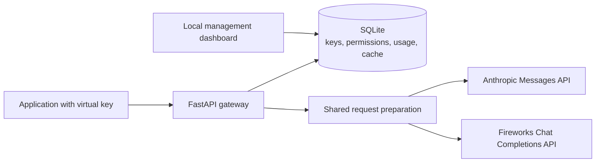

# ProxyLLM

A Python AI gateway that lets applications call **Anthropic and Fireworks through
one OpenAI-compatible API**. Each application gets a virtual key; provider
credentials stay on the gateway.

Built with **FastAPI, HTTPX and SQLite**, with a plain HTML/CSS/JavaScript dashboard.
Designed for a single-host deployment and tested with mock and real providers.

## What you can do

- Send chat requests and stream responses through either provider.
- Create virtual keys, grant provider access and revoke keys from the local dashboard or CLI.
- **Inspect a request before sending it:** preview the translated payload using the same preparation code as execution, without calling a provider.
- Reuse eligible responses for 30 minutes, isolated by virtual key.
- View recorded usage, estimated costs and recent requests.
- Create verified backups and clean expired cache entries.

The gateway enforces 24 requests per key per rolling minute, a default 5 MB
request limit and five simultaneous provider calls per process.

## How it works



The gateway authenticates the key, checks provider access, translates the request,
and returns an OpenAI-shaped response. The dashboard manages the same local data.
See [architecture](ARCHITECTURE.md) for the request flow and design tradeoffs.

## Run locally

Use **Python 3.11+ on macOS or Linux**. Run from the repository root.

### 1. Install and configure

```bash
python3 -m venv .venv
.venv/bin/python -m pip install -r requirements.txt
cp -n .env.example .env
```

For the Anthropic example below, set `ANTHROPIC_API_KEY` in `.env`.
For Fireworks, set `FIREWORK_API_KEY` and `FIREWORK_URL`; the example file includes
its URL. Configure only the providers you intend to use. Never commit `.env`.

### 2. Create an application key

```bash
.venv/bin/python -m auth.database
.venv/bin/python -m auth.cli create --app my-app --provider anthropic
```

Save the virtual key shown once. It is the key your application uses.

Existing databases must be private to your user before startup; see the
[permission correction steps](docs/backups.md#database-permissions) if an older installation is rejected.

### 3. Start the gateway and dashboard

```bash
.venv/bin/python -m uvicorn api.main:app --reload --host 127.0.0.1 --port 8000
```

In another terminal, from the repository root:

```bash
.venv/bin/python -m dashboard.app
```

Open the [dashboard](http://127.0.0.1:8001) to manage keys, usage and maintenance.
The [gateway root](http://127.0.0.1:8000/) checks process reachability only.
Stop each server with Control-C; restart the gateway after configuration changes.

### 4. Send a request

Set `PROXY_VIRTUAL_KEY` locally to the key from step 2, then run:

```bash
curl --fail-with-body http://127.0.0.1:8000/v1/chat/completions \
  -H "Authorization: Bearer $PROXY_VIRTUAL_KEY" \
  -H 'Content-Type: application/json' \
  -d '{"model":"anthropic/claude-sonnet-5","messages":[{"role":"user","content":"Say hello."}],"max_tokens":50,"cache":false}'
```

Real-provider calls cost money. To preview the payload without a provider call,
change the endpoint to `/v1/inspect`. A `prepared` result means local preparation
succeeded; upstream acceptance remains unverified.

OpenAI-compatible clients use base URL `http://127.0.0.1:8000/v1` and your virtual
key. Configured model names include `anthropic/claude-sonnet-5` and
`fireworks/deepseek-v4-flash`; the key needs permission for the selected provider.

## Test without provider charges

```bash
PROXY_DROP_SAMPLING_PARAMS='{}' PROXY_MAX_REQUEST_BYTES=5000000 \
MOCK_PROVIDER_DELAY_MS=0 MOCK_PROVIDER_FAIL_EVERY=0 MOCK_PROVIDER_RESPONSE_TOKENS=8 \
.venv/bin/python -m unittest discover -s tests -v

PROXY_DROP_SAMPLING_PARAMS='{}' .venv/bin/python -m benchmarks.inspection_demo
```

These use temporary databases and mock providers. The inspection demo verifies
that the preview matches the actual outgoing payload. For a repeatable local
walkthrough covering successful requests, denied access, streaming and caching,
run:

```bash
.venv/bin/python -m client_testing.evidence_suite
```

Reports are written under the ignored `benchmarks/results/` directory. The suite
starts isolated mock services, uses temporary databases and makes no paid calls.

## Limits

ProxyLLM is a single-host gateway rather than a public multi-tenant service. Keep
the management dashboard localhost-only; it does not authenticate individual admins.
Anthropic supports text chat with a limited set of translated settings.
Streaming bypasses the response cache. Usage costs are estimates, and middleware
rejections are not included in usage totals. Cached answers and backups are private data.
SQLite and provider-call limits are process-local, so this design is not suitable
for multi-host high availability. There is no automatic provider fallback, global
spending budget, public TLS deployment, or off-machine disaster recovery.

## Further reading

- [Architecture](ARCHITECTURE.md) — request flow, storage and deployment boundaries.
- [Request inspection](docs/inspection.md) · [Sampling policy](docs/parameter-policy.md).
- [Dashboard](dashboard/README.md) · [Backups](docs/backups.md) · [Cache cleanup](docs/cache-cleanup.md).
- [Testing and benchmarks](client_testing/README.md).
